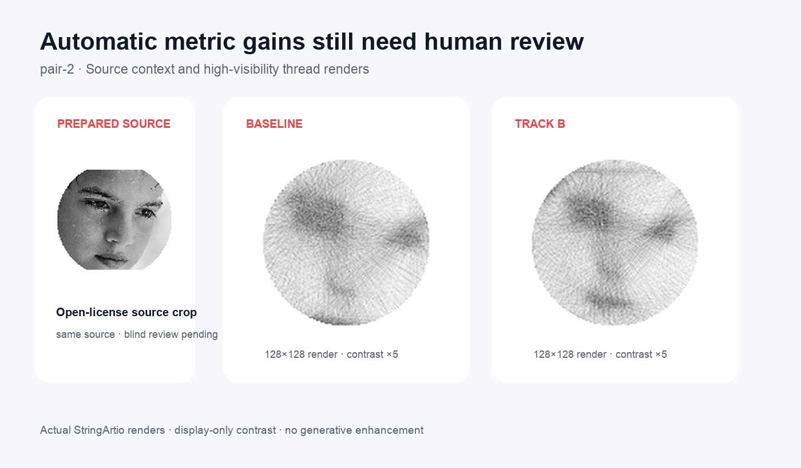

# Human Preference 기반 품질 최적화 시스템

> StringArtio Preference Lab · 정량 지표만으로 놓치는 미적 품질을 blind A/B
> human preference로 보완하는 Python sidecar

[Public portfolio mirror](https://github.com/internalforces/human-preference-quality-optimization)

String art의 SSIM·runtime·line count가 좋아도 얼굴이 흐리거나 실이 뭉치고,
앱에서는 지나치게 희미할 수 있습니다. 이 프로젝트는 기존 StringArtio 결과를
읽어 같은 source의 후보를 blind 비교하고, Bradley–Terry 계열 reward model과
hard constraint를 결합해 다음 실험 후보를 제안합니다. Generator를 자동 실행하거나
사람의 라벨을 metric으로 대체하지 않습니다.

## 시연

진단 이미지에서 추출한 준비된 source crop과 같은 source에서 생성한
128×128 thread render를 함께 비교합니다.
Baseline보다 Track B에서 눈·코·입의 구조가 더 분명하게 남는 사례입니다. 작은
README 화면에서도 실선을 확인할 수 있도록 표시 대비만 5배 높였으며, 원본 render의
형상이나 평가 데이터에는 손대지 않았습니다. 이 비교의 blind review는 아직
수행되지 않았습니다.



[고정 crop과 픽셀 차이 상세 보기](portfolio/assets/pair-2-detail-diff.png) ·
[4개 source의 대형 비교 갤러리](docs/case-study.md#public-beforeafter-gallery) ·
[blind review 화면](portfolio/assets/blind-review-example.png)

## 핵심 결과와 현재 증거 수준

현재 private working dataset snapshot은 후보 9,341개, human review 445건,
라벨이 있는 source 4개입니다. Source holdout에서 full preference model은
**73.17%** accuracy로 metric baseline **68.70%**보다 4.47%p 높았지만,
log loss는 0.708 대 0.624로 더 나빴습니다. 따라서 reward score는 보조 ranking
신호이며 metric을 대체하는 근거가 아닙니다.

Source별 동일 가중치 macro accuracy는 full model **74.21%**, metric baseline
**70.29%**입니다. Full model의 source-bootstrap 95% accuracy interval은
**68.84–78.43%**이고 baseline은 **58.70–79.41%**로 서로 겹칩니다.

| 확인 항목 | 현재 상태 |
|---|---|
| Core constraint pass | 2,245 / 9,341 = **24.03%** |
| Full suggestion-anchor pass | 136 / 9,341 = **1.46%** |
| Labeled source | **4 / 권장 10+** — 아직 부족 |
| Reviewer field aliases | 3개이나 독립된 사람임이 확인되지 않음 |
| 동일 쌍 복수 reviewer 평가 | **0건** — 일치도 산출 불가 |
| 실제 suggestion vs baseline blind 승률 | **미측정** — 수동 generator 실행 필요 |

평가 report는 source 전체를 재표집하는 deterministic bootstrap 95% CI와,
동일 unordered 후보 쌍에 복수 reviewer가 있을 때 exact agreement 및
chance-corrected kappa를 계산합니다. 표본 조건이 충족되지 않으면 숫자를 만들지
않고 경고를 냅니다.

## 한 명령 재현

새 환경에서 공개 fixture의 축소 파이프라인을 5분 안에 재현합니다.

```bash
python -m pip install -e '.[dev]'
python -m unittest discover -s tests
stringart-lab demo
```

`fixtures/public/`에는 실제 human review에서 추출·익명화한 preference 9건과
candidate feature 17행, 최소 manifest 및 공개 가능한 256px render preview가 있습니다.
개인 경로, 원본·diagnostic source image 경로, source hash, timestamp, 메모는
포함하지 않습니다. 이 fixture는 3개 source이며 10-source 성능 주장의 근거가
아니라 queue→model→suggestion→evaluation 축소 경로 재현용입니다. 결과는
`examples/demo-output/`에 생성되고 suggestion은 `not_executed`로 유지됩니다.

## 실패와 미완료 항목

- `pair-3`의 `both_bad` 비율은 53.47%였습니다. Generalization은 해결되지
  않았습니다.
- reviewer 필드의 세 값은 collection channel 성격도 섞여 있어 독립 리뷰어
  세 명으로 간주하지 않습니다. 겹치는 평가가 생기기 전에는 kappa가 `null`입니다.
- 실제 suggestion은 Preference Lab이 실행하지 않습니다. StringArtio에서 사람이
  수동 실행하고, 학습·anchor에 관여하지 않은 source로 baseline과 blind 비교해야
  합니다. [실험 프로토콜](docs/manual-suggestion-evaluation.md)과
  [미완료 결과 템플릿](portfolio/suggestion-blind-evaluation.json)을 제공합니다.
- 이전 “constrained BO” 명칭은 구현을 과장했습니다. 현재 방식은 관측 anchor를
  제한 범위에서 perturb하고 `mean + uncertainty - failure penalty`로 정렬하는
  constrained preference-guided search이며 Gaussian-process BO가 아닙니다.

## 작동 방식

```text
existing StringArtio outputs (read only)
  -> candidate manifest
  -> numeric features
  -> blind same-source review queue
  -> append-only human preferences
  -> pairwise reward model
  -> constrained suggestion files
  -> manual StringArtio run + blind holdout evaluation
```

모델은 `A`/`B`를 강한 pairwise label로, `tie`를 약한 equality loss로,
`both_bad`를 candidate-level failure signal로 사용합니다. Review queue는
uncertainty, visual risk, random exploration을 섞고 source balance를 유지합니다.

## 전체 로컬 실행

Python 3.9+ 환경에서 설치합니다.

```bash
python3 -m venv .venv
source .venv/bin/activate
python3 -m pip install --upgrade pip
python3 -m pip install -e '.[dev]'
```

StringArtio가 sibling directory가 아니라면 경로만 지정합니다.

```bash
export STRINGARTIO_ROOT=/path/to/stringartio
```

파이프라인은 다음 순서입니다.

```bash
stringart-lab validate-config --create-dirs
stringart-lab ingest
stringart-lab features
stringart-lab queue --limit=50
stringart-lab validate-preferences
stringart-lab train-model
stringart-lab suggest --limit=10
stringart-lab evaluate --output=portfolio/evaluation-report.json
```

쓰기 없이 전체 경로를 확인하려면:

```bash
stringart-lab pipeline --dry-run --limit-runs=3
```

Blind review UI:

```bash
stringart-lab review --port=8765 --reviewer=<stable-human-id>
```

복수 리뷰어 일치도를 측정하려면 각 reviewer가 공유된 calibration pair를 일부
중복 평가해야 합니다. ID는 사람별로 안정적이어야 하며 UI/channel 이름을 reviewer
ID로 사용하면 안 됩니다.

## Hard constraints

Suggestion engine은 파일만 쓰며 다음 조건을 약화하지 않습니다.

- `app_ready == true`
- runtime target 및 line-count limit
- visibility floor와 app-upload target
- no target-aware logic
- no automatic JS experiment execution

StringArtio generator 실행과 app 기본값 승격은 이 저장소 범위 밖입니다. 자동
metric 개선은 human preference 승리로 주장하지 않습니다.

## 데이터와 재현성

- `data/preferences/preferences.jsonl`은 append-only이며 공개 저장소에서는 ignore됩니다.
- `fixtures/public/preferences.jsonl`은 익명화된 공개 subset입니다.
- `fixtures/public/features.csv`는 모델·평가에 필요한 최소 숫자 열만 포함합니다.
- `fixtures/public/fixture-manifest.json`은 선택·익명화·한계를 기록합니다.
- `portfolio/evaluation-report.json`은 full local snapshot의 machine-readable report입니다.

대형 비교 이미지를 다시 만드는 선택적 명령(Pillow 필요):

```bash
python3 scripts/build_gallery_assets.py
```

## 문서

- [Case study](docs/case-study.md): 방법, 결과, ablation, 대형 gallery, 실패
- [Manual suggestion evaluation](docs/manual-suggestion-evaluation.md): untouched-source
  blind 승률 프로토콜
- [Architecture](docs/architecture.md): 경계, 모델링, suggestion engine
- [Data flow](docs/data-flow.md): command별 데이터 흐름
- [Preference schema](docs/preference-schema.md): append-only label 규칙
- [Commands](commands.md): 전체 명령 reference
- [Visibility failure analysis](docs/visibility-failure-analysis.md): 희미한 render 실패 분석

## 프로젝트 경계와 구현 범위

- [StringArtio product](https://stringartio.vercel.app)는 전처리, JS/Rust 생성기,
  실험 실행, 실제 render/export, app-ready 판정과 기본값 승격을 소유합니다.
  본체 source repository는 현재 비공개입니다.
- [StringArtio Preference Lab 공개 미러](https://github.com/internalforces/human-preference-quality-optimization)는
  read-only 수집, blind review, append-only preference, 모델 학습·holdout 평가,
  제약 기반 `not_executed` suggestion 생성을 소유합니다.
- 이 포트폴리오 범위에서 직접 설계·구현한 부분은 정규화 schema, review queue,
  pairwise model과 ablation, source/run holdout, bootstrap report, 제약 검증,
  공개 fixture/demo 및 두 저장소 handoff 계약입니다.

두 저장소는 같은 generation-quality contract version/hash를 사용합니다. Lab이 만든
suggestion은 StringArtio에서 사람이 승인해 다시 실행하기 전까지 결과가 아닙니다.

개발 에이전트용 운영 문서는 [AGENTS.md](AGENTS.md), [CLAUDE.md](CLAUDE.md),
[CODEX.md](CODEX.md), [GEMINI.md](GEMINI.md)에 있습니다.

## License

Code is MIT licensed. Public image attribution is recorded in
[portfolio/assets/ATTRIBUTION.md](portfolio/assets/ATTRIBUTION.md).
