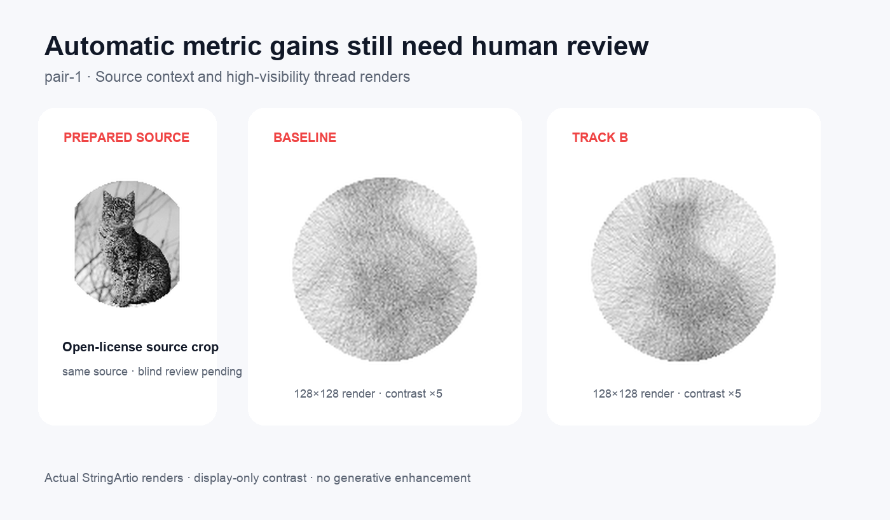
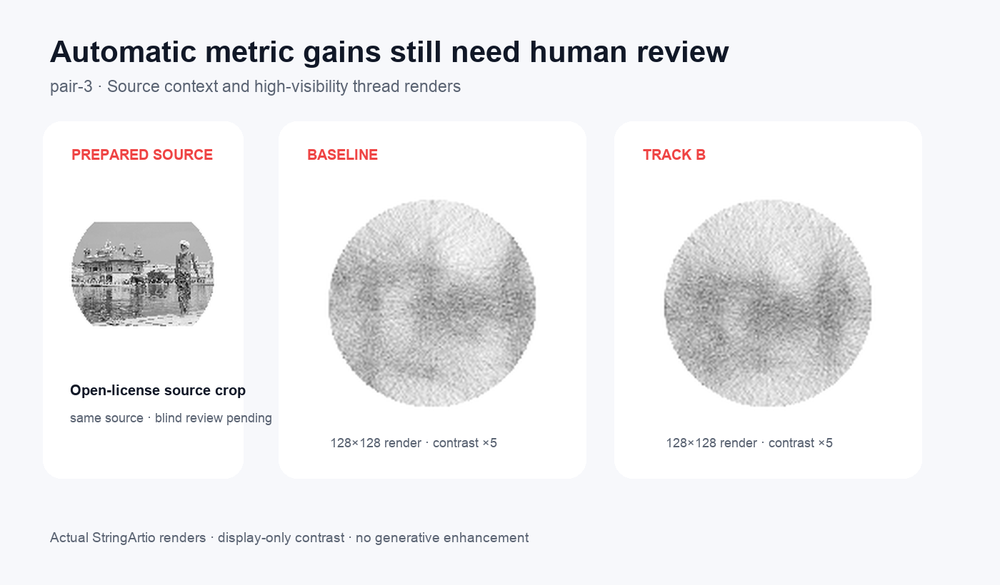
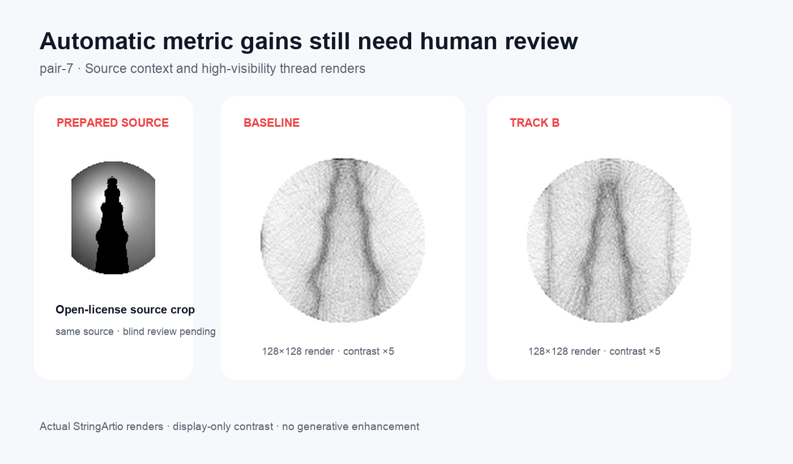
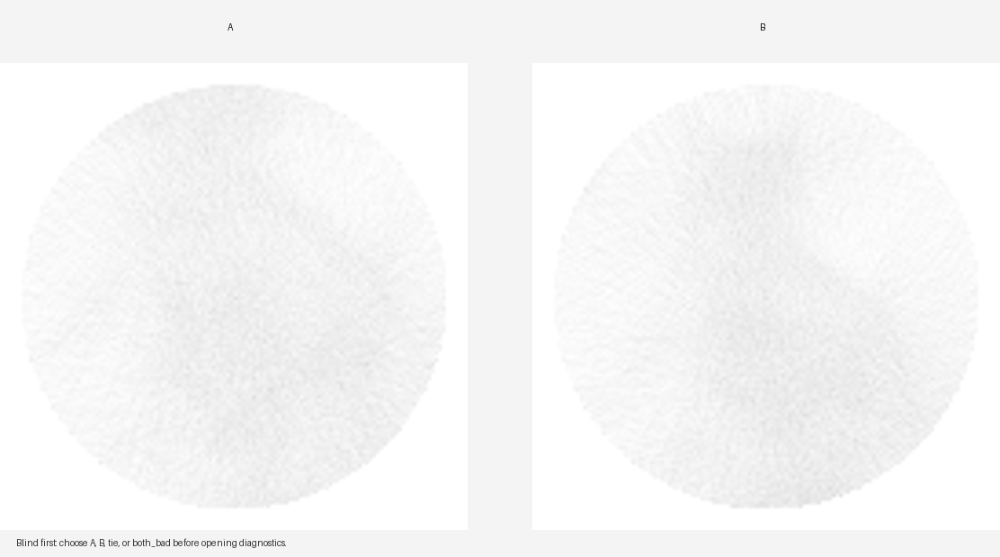

# Human Preference 기반 품질 최적화 시스템 — case study

> Snapshot: 2026-08-09 · 9,341 candidates · 445 human reviews · 7 observed
> sources · 4 labeled sources · 24 runs

## Problem, hypothesis, and data

String-art reconstruction metrics reward similarity, but do not reliably capture
whether the result reads as clean, visible artwork. The hypothesis was that a
blind same-source preference signal could improve ranking while hard gates keep
suggestions app-ready, under 30 seconds, at or below 6,000 lines, and free of
target-aware logic.

The lab ingested existing StringArtio artifacts read-only. The append-only label
set contains **128 A wins, 118 B wins, 56 ties, and 143 `both_bad` reviews**.
No metric score was converted into a human label. Four public robustness sources
below are open-licensed; attribution is recorded in
[`portfolio/assets/ATTRIBUTION.md`](../portfolio/assets/ATTRIBUTION.md).

## Method

1. Normalize source-level candidates and numeric config/quality features.
2. Queue blind, same-source A/B pairs; reveal diagnostics only after the choice.
3. Train a Bradley–Terry-style pairwise logistic model. `tie` is a weak equality
   loss; `both_bad` is a candidate failure signal; reason flags add a masked
   auxiliary loss.
4. Evaluate by leaving out a complete `source_id`, and separately by leaving out
   a complete run. Run-holdout training excludes every pair touching that run.
5. Produce suggestions with **constrained preference-guided search**. This is a
   bounded perturb-and-rank heuristic, not Gaussian-process Bayesian Optimization.

Reproduce the report:

```bash
stringart-lab evaluate --output=portfolio/evaluation-report.json
```

## Measured results

Human review iterations against reference run `20260628123602`:

| Challenger run | Reviews | Decisive challenger win rate | `both_bad` rate |
|---|---:|---:|---:|
| `20260628142912` | 44 | 51.72% | 25.00% |
| `20260628170442` | 44 | **63.33%** | 15.91% |
| `20260629115003` | 44 | 28.57% | 22.73% |
| `20260630144957` | 24 | 54.17% | **0.00%** |

The peak challenger raised decisive win rate **11.61 percentage points** over
the first challenger. The latest shortlist was only **2.45 points** above the
first, while its `both_bad` rate fell from 25% to 0% (**100% relative decrease**).
This is an iterative result, not a monotonic improvement claim.

Current hard-constraint and runtime snapshot:

| Measure | Actual value |
|---|---:|
| Core constraint pass (`app_ready`, runtime, lines, no target-aware logic) | 2,245 / 9,341 = **24.03%** |
| Full suggestion-anchor pass (also visibility and regenerated-failure gates) | 136 / 9,341 = **1.46%** |
| Runtime, all candidates | median **6.868 s**, p95 **10.094 s**, max **48.111 s** |
| Runtime, full eligible anchors | median **3.708 s**, p95 **20.700 s**, max **23.097 s** |

Source-level human outcomes expose the main failure concentration:

| Source | Reviews | A/B/tie/`both_bad` | `both_bad` rate |
|---|---:|---:|---:|
| `pair-1` | 129 | 41 / 37 / 10 / 41 | 31.78% |
| `pair-2` | 119 | 31 / 35 / 20 / 33 | 27.73% |
| `pair-3` | 101 | 26 / 12 / 9 / 54 | **53.47%** |
| `pair-4` | 96 | 30 / 34 / 17 / 15 | 15.63% |

## Baseline and ablation

Accuracy is computed only on held-out A/B decisions; ties and `both_bad` remain
training signals but are not forced into an A-vs-B test label. Metric-baseline
probabilities use `sigmoid(8 × score difference)`; this fixed mapping affects
log loss but not pairwise accuracy.

| Model | Source holdout (246) | Run holdout (90) | Source log loss | Run log loss |
|---|---:|---:|---:|---:|
| Metric baseline | 68.70% | **85.56%** | **0.624** | 0.284 |
| Pairwise only | 67.48% | 84.44% | 1.286 | 0.306 |
| + tie / `both_bad` | 65.04% | 83.33% | 1.166 | 0.252 |
| + reason flags (full) | **73.17%** | 83.33% | 0.708 | **0.243** |

Source별 동일 가중치 macro 결과는 full model accuracy **74.21%** / log loss
**0.710**, metric baseline accuracy **70.29%** / log loss **0.605**입니다. Run별
macro accuracy는 full model **61.65%**, metric baseline **68.17%**로, 큰 run이
전체 micro accuracy를 지배하는 효과를 분리해도 run holdout 결론은 바뀌지 않습니다.

Deterministic source-level bootstrap resamples complete `source_id` folds 2,000
times. The 95% accuracy interval is **68.84–78.43%** for the full model and
**58.70–79.41%** for the metric baseline. These intervals overlap and are based
on only four labeled sources; they quantify current uncertainty rather than
establishing a general improvement claim.

The full model improves source-holdout accuracy by **4.47 points** over the
metric baseline, but calibration is worse (0.708 vs 0.624 log loss). On
run-holdout, the metric baseline remains more accurate. The reward model is
therefore useful as a sidecar ranking signal, not evidence that metrics can be
discarded.

## Public before/after gallery

Each diagnostic image shows prepared source, rendered thread output, and target.
“After” is Track B scene-adaptive cleanup from run `20260717132239`; the score
is an automatic diagnostic, **not a human preference**. It changed by +1.43%
for cat (0.551531→0.559426), +5.86% for portrait (0.519201→0.549611),
+1.40% for complex background (0.557362→0.565161), and +13.81% for backlight
(0.396883→0.451710). These metric gains still require blind review.

Each panel places a prepared source crop extracted from the diagnostic image
beside the Baseline and Track B thread renders. The crop is resized and circularly
masked for this layout. Render display contrast is increased 5× so the 128×128
thread geometry remains legible at documentation scale; render geometry and
evaluation data are unchanged. The linked detail views retain the fixed center
crop and the 12× absolute pixel difference. No generated detail was added, and
blind review of these comparisons is still pending.

### Cat



[Fixed crop and pixel difference](../portfolio/assets/pair-1-detail-diff.png)

### Portrait


[Fixed crop and pixel difference](../portfolio/assets/pair-2-detail-diff.png)

### Complex background



[Fixed crop and pixel difference](../portfolio/assets/pair-3-detail-diff.png)

### Backlight



[Fixed crop and pixel difference](../portfolio/assets/pair-7-detail-diff.png)

Blind review example — candidate identity and diagnostics are hidden until the
reviewer chooses A, B, tie, or `both_bad`:



## Failures and what changed

- `pair-3` still has a 53.47% `both_bad` rate; generalization is not solved.
- Only four sources currently have labels, below the 10-source evaluation target.
- The reviewer field has three values, but none of the 445 candidate pairs was
  reviewed under two reviewer identifiers. Independent reviewer identity is not
  established, so exact agreement and kappa are correctly reported as `null`.
- A real suggestion-vs-baseline win rate on untouched sources is still pending
  manual StringArtio execution and blind review. The tracked result template
  remains `pending_manual_run`; automatic gallery score gains are not presented
  as that result.
- A residual-cleanup robustness run stopped manually with no completed episode,
  so it is retained as a failed experiment, not reported as a result.
- The former “constrained BO skeleton” name overstated the implementation. Code,
  CLI help, and docs now call it constrained preference-guided search and emit
  `bayesian_optimization: false` in provenance.
- The previously ignored one-off review server is now a tracked package module.
  Saved labels include interface schema, queue id, reviewer, and `blind_first`
  provenance while preserving append-only JSONL.

Full machine-readable numbers: [evaluation-report.json](../portfolio/evaluation-report.json).
